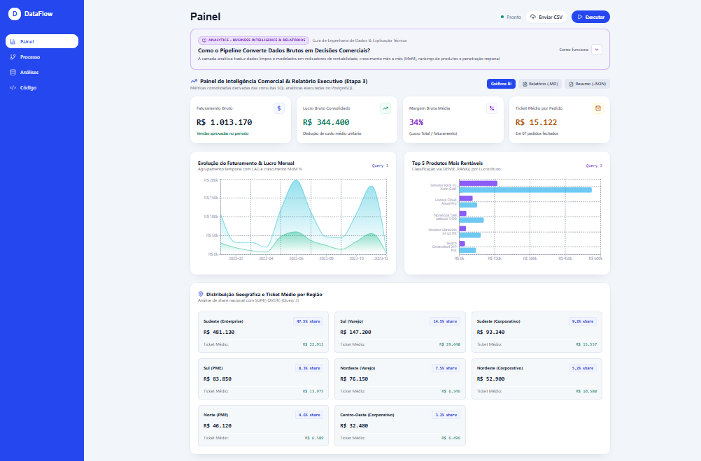

# DataFlow ETL & Analytics

Pipeline de engenharia de dados de ponta a ponta, com um painel web para acompanhar cada etapa.

Os dados de vendas chegam sujos (datas em vários formatos, valores com `R$` e vírgula, campos vazios, registros repetidos). O projeto lê esses dados, limpa, guarda em um banco PostgreSQL, responde perguntas de negócio com SQL e mostra tudo em um painel.

   
---

## O que o projeto faz

1. **Gera** vendas de exemplo com erros propositais.
2. **Lê** os arquivos CSV e separa os registros com problemas graves.
3. **Limpa** os dados com Pandas: padroniza datas, corrige valores, remove repetidos e calcula faturamento, custo e lucro.
4. **Salva** no PostgreSQL sem duplicar registros (UPSERT).
5. **Analisa** com SQL avançado: crescimento mês a mês, ranking de produtos, totais acumulados.
6. **Reporta** o resumo final em JSON e Markdown.

---

## O painel

| Aba | O que mostra |
|---|---|
| **Painel** | Indicadores principais: faturamento, lucro, margem e vendas. |
| **Processo** | Fluxo das etapas, registro da execução, verificações de qualidade, registros com problemas e comparação antes e depois da limpeza. |
| **Análises** | Consultas SQL prontas e um editor para consultar os dados limpos. |
| **Código** | Arquivos do projeto e explicação de como tudo funciona. |

Botões no topo:

- **Executar** roda o processo completo.
- **Enviar CSV** processa um arquivo seu.

> O painel roda a simulação do pipeline direto no navegador, sem precisar de servidor nem de banco. O pipeline real em Python + PostgreSQL roda separado, via Docker.

---

## Como rodar

### Painel (frontend)

Requisitos: Node.js 20 ou superior.

```bash
npm install
npm run dev
```

Abra `http://localhost:3000`.

Outros comandos:

```bash
npm run build     # gera a versão de produção em dist/
npm run preview   # testa a versão de produção
npm run lint      # verifica os tipos do TypeScript
```

### Pipeline real (Python + PostgreSQL)

Requisitos: Docker e Docker Compose.

```bash
docker-compose up --build
```

Esse comando:

1. Sobe o PostgreSQL 15 e cria as tabelas (`sql/01_schema.sql`).
2. Espera o banco ficar saudável.
3. Executa `python main.py --full-run`.
4. Salva os relatórios em `data/reports/`.

Para rodar sem Docker:

```bash
pip install -r requirements.txt
python src_python/main.py --full-run
```

As credenciais do banco podem ser trocadas com as variáveis `POSTGRES_USER`, `POSTGRES_PASSWORD` e `POSTGRES_DB` (valores padrão no `docker-compose.yml`).

---

## Estrutura

```text
├── index.html
├── package.json
├── vite.config.ts
├── tsconfig.json
├── docker-compose.yml        # PostgreSQL + container do pipeline
├── Dockerfile                # Imagem do pipeline Python
├── requirements.txt
├── sql/
│   ├── 01_schema.sql         # Tabelas do banco
│   └── 02_analytical_queries.sql
├── data/
│   ├── raw/                  # CSVs de entrada (com erros)
│   ├── processed/            # Dados limpos
│   └── reports/              # Relatórios finais (.json e .md)
├── src_python/
│   ├── generator.py          # Gera os dados sujos
│   ├── extract.py            # Lê e valida os arquivos
│   ├── transform.py          # Limpeza com Pandas
│   ├── load.py               # Carga no PostgreSQL
│   ├── report.py             # Consultas e relatórios
│   └── main.py               # Executa tudo em ordem
└── src/                      # Painel web
    ├── main.tsx
    ├── App.tsx
    ├── index.css             # Cores, fontes e estilo
    ├── components/           # Telas e blocos do painel
    ├── services/
    │   └── pipelineSimulator.ts  # Simulação do pipeline no navegador
    └── types/
        └── pipeline.ts
```

---

## Modelo de dados

- **clientes**: `id_cliente`, `nome`, `email`, `regiao`, `segmento`, `data_cadastro`
- **vendedores**: `id_vendedor`, `nome`, `email`, `meta_mensal`, `ativo`
- **produtos**: `id_produto`, `nome`, `categoria`, `preco_tabela`, `custo_medio`
- **vendas** (tabela principal): `id_venda`, `id_cliente`, `id_vendedor`, `id_produto`, `quantidade`, `preco_unitario`, `faturamento_total`, `custo_total`, `lucro_bruto`, `data_venda`, `canal_venda`, `status_pagamento`

As tabelas se ligam por chaves estrangeiras, e há regras de validação (`CHECK`) para impedir valores inválidos.

---

## Exemplos de consulta

**Faturamento por mês, com variação em relação ao mês anterior**

```sql
SELECT
    TO_CHAR(v.data_venda, 'YYYY-MM') AS mes,
    SUM(v.faturamento_total) AS faturamento_atual,
    LAG(SUM(v.faturamento_total), 1) OVER (ORDER BY TO_CHAR(v.data_venda, 'YYYY-MM')) AS faturamento_anterior,
    ROUND(
        ((SUM(v.faturamento_total) - LAG(SUM(v.faturamento_total), 1) OVER (ORDER BY TO_CHAR(v.data_venda, 'YYYY-MM'))) /
        NULLIF(LAG(SUM(v.faturamento_total), 1) OVER (ORDER BY TO_CHAR(v.data_venda, 'YYYY-MM')), 0)) * 100, 2
    ) AS variacao_mom_pct
FROM vendas v
WHERE v.status_pagamento = 'Aprovado'
GROUP BY TO_CHAR(v.data_venda, 'YYYY-MM')
ORDER BY mes ASC;
```

**Cinco produtos mais lucrativos**

```sql
SELECT
    p.nome AS produto,
    SUM(v.faturamento_total) AS faturamento,
    SUM(v.lucro_bruto) AS lucro_total,
    DENSE_RANK() OVER (ORDER BY SUM(v.lucro_bruto) DESC) AS rank_lucro
FROM produtos p
JOIN vendas v ON p.id_produto = v.id_produto
WHERE v.status_pagamento = 'Aprovado'
GROUP BY p.nome
ORDER BY rank_lucro ASC
LIMIT 5;
```

---

## Tecnologias

| Área | Ferramentas |
|---|---|
| Painel | React 19, TypeScript, Vite, Tailwind CSS 4, Recharts, Lucide |
| Pipeline | Python 3.11, Pandas, NumPy, SQLAlchemy, psycopg2, Faker |
| Banco | PostgreSQL 15 |
| Infraestrutura | Docker e Docker Compose |

---

